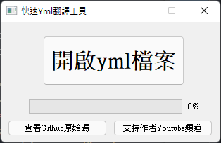

# 快速YML翻譯工具
### 簡介
最近想來自己開個麥塊伺服器\
裝了不少插件，也自己寫了一些\
但在使用國外插件時\
總是常常需要自己去翻譯\
~~真麻煩~~\
於是就做了這個\
機器翻譯+人工微調其實效果還不錯的~

### 使用說明
1.按下"開啟yml檔案"按鈕\
2.選擇要開啟的yml檔案\
3.等待進度條跑完\
4.生成的`FileName(translate).yml`檔案即是翻譯結果

### 軟體特色
- GUI簡易操作
- 翻譯速度快
- 開放原始碼

### 未來功能
- 添加更多可翻譯語言(目前僅支援繁體中文)
- 添加生成檔案位置顯示、快速開啟功能

### 已知問題
- 只能單層翻譯，無法翻譯陣列、字典內的資料(待修復)